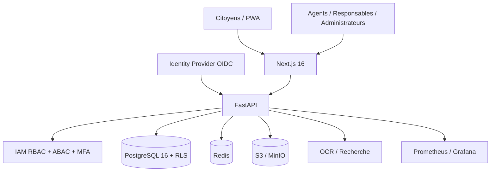

<div align="center">


# 🏛️ eAdmin Guinée

### Plateforme GovTech multi-institution pour la digitalisation des services publics

**Conçu et développé par DataSphere Innovation**

[]()
[](https://nextjs.org)
[](https://fastapi.tiangolo.com)
[](https://www.postgresql.org)

</div>

---

## Vision

**eAdmin Guinée** est une plateforme GovTech destinée à outiller les ministères, directions, agences, collectivités et services publics dans la dématérialisation de leurs processus administratifs et de leurs interactions avec les citoyens.

Le projet vise une architecture **souverainisable, auditable, multi-institution et industrialisable**, adaptée aux contraintes de connectivité et d'exploitation rencontrées en Guinée.

> **Important — statut institutionnel :** le dépôt contient des fondations techniques avancées, mais ne revendique pas à lui seul une homologation de l'État, une certification juridique, une qualification PKI, une signature électronique qualifiée ou un archivage légal certifié. Ces statuts nécessitent des validations et partenaires externes identifiés.

---

## Capacités actuellement intégrées

### Portail citoyen et démarches

- catalogue de démarches administratives **versionné et serveur-authoritative** ;
- soumission et suivi des demandes persistés dans PostgreSQL ;
- routage vers une institution active ;
- pièces justificatives stockées côté serveur avec contrôle d'upload et antivirus en production ;
- cycle de traitement, notes, affectation, livraison et satisfaction ;
- idempotence des soumissions pour les reconnexions mobiles ;
- PWA et stratégie faible débit / reprise après perte de réseau.

### Gestion documentaire

- GED persistée côté serveur ;
- versions de fichiers liées aux documents ;
- stockage objet S3/MinIO ;
- contrôle d'intégrité et URLs temporaires ;
- OCR réel via Tesseract ;
- recherche plein texte PostgreSQL.

### IAM et sécurité d'accès

- JWT et sessions contrôlées ;
- MFA ;
- RBAC hiérarchique ;
- ABAC et habilitations temporaires ;
- séparation des tâches ;
- break-glass gouverné et audité ;
- cycle Joiner / Mover / Leaver ;
- campagnes de recertification des accès ;
- Row-Level Security PostgreSQL pour l'isolation tenant/institution ;
- fédération SSO OIDC.

### Parapheur, confiance et traçabilité

- parapheur numérique et décisions liées à une version de document ;
- preuves internes basées sur identité, version, hash et horodatage ;
- frontière PKI fail-closed lorsqu'une confiance externe n'est pas configurée ;
- journal d'audit des actions sensibles.

**Aucune qualification de signature électronique n'est revendiquée tant qu'une autorité de certification et le cadre juridique/opérationnel correspondants ne sont pas formellement intégrés et homologués.**

### IA assistée

- OCR et extraction de contenu ;
- assistance IA fondée sur des sources disponibles ;
- provenance et garde-fous contre les réponses administratives non sourcées ;
- validation humaine conservée pour les décisions administratives.

La plateforme ne doit pas être présentée comme prenant de façon autonome des décisions administratives produisant des effets juridiques.

### Exploitation nationale

- images Docker reproductibles ;
- baseline Kubernetes ;
- probes de santé ;
- observabilité Prometheus/Grafana ;
- PRA/PCA documenté et contrôlé par des gates ;
- procédure SOC / réponse aux incidents ;
- CI GitHub Actions avec contrôles Government Readiness, IAM, SSO, PKI, résilience et faible débit.

---

## Cadre réglementaire à instruire

La conformité doit être examinée avec les autorités et conseils compétents au regard des textes guinéens applicables. Parmi les références publiées par l'ARPT figurent notamment :

- **Loi L/2015/037/AN relative à la cybersécurité et à la protection des données à caractère personnel** ;
- **Loi L/2016/035/AN relative aux transactions électroniques**.

Référence officielle : [ARPT — Lois et Ordonnances](https://www.arpt.gov.gn/lois-et-ordonnances/)

La documentation du projet ne revendique pas une conformité à l'UEMOA : la République de Guinée n'est pas un État membre de cette union. Toute référence régionale utilisée dans un dossier officiel doit être vérifiée au regard du cadre effectivement applicable à la Guinée.

Pour le cadrage d'une présentation gouvernementale, voir :

**[docs/GOVERNMENT_PRESENTATION_READINESS.md](docs/GOVERNMENT_PRESENTATION_READINESS.md)**

---

## Architecture de référence


```mermaid
graph TB
    Citizen[Citoyens / PWA]
    Staff[Agents / Responsables / Administrateurs]
    IdP[Identity Provider OIDC]
    Front[Next.js 16]
    API[FastAPI]
    IAM[IAM RBAC + ABAC + MFA]
    PG[(PostgreSQL 16 + RLS)]
    Redis[(Redis)]
    Storage[(S3 / MinIO)]
    OCR[OCR / Recherche]
    Obs[Prometheus / Grafana]

    Citizen --> Front
    Staff --> Front
    IdP --> API
    Front --> API
    API --> IAM
    API --> PG
    API --> Redis
    API --> Storage
    API --> OCR
    API --> Obs
```

### Principes structurants

1. **Le navigateur n'est jamais l'autorité métier.** Les identités, règles, métadonnées officielles et décisions sensibles sont validées côté serveur.
2. **Fail closed en production.** Les services critiques de sécurité ne doivent pas basculer silencieusement vers un mode dégradé permissif.
3. **Isolation en profondeur.** Les contrôles applicatifs sont renforcés par PostgreSQL RLS.
4. **Traçabilité.** Les décisions d'autorisation et opérations sensibles sont auditables.
5. **IA assistive.** L'IA fournit une aide sourcée et n'est pas l'autorité administrative.
6. **Conformité prouvée, pas déclarée.** Toute affirmation juridique ou institutionnelle doit être reliée à une preuve ou marquée comme restant à homologuer.

---

## Gouvernance des démarches administratives

Le catalogue des démarches est versionné côté serveur. Les informations de frais, délais, pièces et sources sont figées au moment de la création d'une demande afin de conserver l'historique de la règle appliquée.

Les politiques internes utilisées pour un pilote doivent rester identifiées comme telles. Un délai ou un tarif ne doit être présenté comme **réglementaire** que lorsqu'une source officielle approuvée est associée à la version concernée.

---

## Gestion des documents administratifs générés

Le projet est en cours de durcissement sur ce point.

La cible nationale est la suivante :

- modèles administratifs versionnés côté serveur ;
- association explicite modèle / service / institution ;
- approbation du modèle avant activation ;
- génération serveur uniquement ;
- échappement des données injectées ;
- hash serveur du rendu ;
- conservation de la version du modèle ;
- blocage si aucun modèle approuvé n'existe ;
- signature/PKI traitée comme une étape de confiance séparée.

Aucun HTML composé par un navigateur ne doit devenir, à lui seul, un document officiel faisant foi.

---

## CI / Government Readiness

Les pull requests déclenchent plusieurs gates, notamment :

- backend lint + tests ;
- frontend lint + typecheck + build ;
- chaîne complète des migrations PostgreSQL ;
- Gitleaks et scan des vulnérabilités ;
- builds Docker reproductibles ;
- IAM Governance ;
- IAM Lifecycle ;
- SSO Federation ;
- PKI Trust Boundary ;
- Operational Resilience ;
- Low Bandwidth Offline.

Les seuils ne doivent pas être abaissés pour faire passer une correction.

---

## Développement local

### Prérequis

- Docker et Docker Compose ;
- Python 3.12+ ;
- Bun ;
- PostgreSQL/Redis/MinIO fournis par la stack Docker pour le développement intégré.

### Cloner le dépôt

```bash
git clone https://github.com/skaba89/eAdmin-guinee.git
cd eAdmin-guinee
```

### Backend

```bash
cd backend
python -m venv .venv
source .venv/bin/activate   # Linux/macOS
# .venv\Scripts\activate    # Windows
pip install -r requirements.txt
alembic upgrade head
uvicorn app.main:app --reload --port 8000
```

### Frontend

```bash
bun install
bun run dev
```

### Docker

```bash
docker compose up -d --build
```

Avant tout environnement partagé ou de production, utiliser les fichiers d'exemple du dépôt et la documentation d'exploitation ; ne jamais réutiliser des secrets ou mots de passe de développement.

---

## Priorités avant pilote institutionnel

Les principales étapes restantes sont :

1. supprimer toute autorité du navigateur sur la génération des documents administratifs ;
2. faire valider un premier catalogue de démarches par les institutions propriétaires ;
3. intégrer la source d'identité réellement retenue pour le pilote ;
4. définir l'hébergement cible, le chiffrement au repos, la gestion des clés et les responsabilités d'exploitation ;
5. réaliser les tests de charge, PRA/PCA et sécurité dans l'environnement cible ;
6. constituer le dossier protection des données et les formalités/avis applicables ;
7. sélectionner et intégrer le dispositif PKI/signature si une valeur juridique de signature est requise ;
8. exécuter un pilote limité avec KPI et critères de sortie explicites.

---

## Proposition de pilote

Un premier pilote peut cibler **1 à 3 institutions** et un nombre limité de démarches à forte valeur d'usage. Les KPI doivent au minimum couvrir :

- disponibilité ;
- taux de demandes abouties ;
- délai médian de traitement ;
- taux de dossiers incomplets ;
- taux de synchronisation après coupure réseau ;
- satisfaction citoyenne ;
- incidents IAM/RLS ;
- RPO/RTO observés lors d'un exercice PRA ;
- performance et coût infrastructure.

---

## Licence

Logiciel propriétaire DataSphere Innovation. Toute utilisation, distribution ou intégration institutionnelle doit respecter les conditions de licence applicables.

Copyright © 2024-2026 DataSphere Innovation.

---

## Contact

**DataSphere Innovation**  
Conakry, République de Guinée

---

<div align="center">

**eAdmin Guinée — des services publics numériques plus accessibles, traçables et industrialisables.**

</div>
